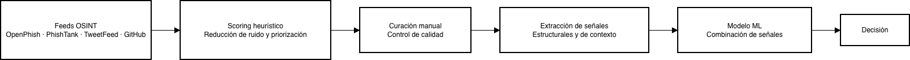

# Arquitectura del sistema

Este documento describe la arquitectura lógica del sistema, centrada en la separación de responsabilidades y el flujo de trabajo entre sus componentes.

## 1. Visión general

El sistema se estructura como un pipeline secuencial, donde las URLs atraviesan bloques con responsabilidades bien definidas, desde la ingesta inicial hasta la decisión final de riesgo.

## 2. Principios de diseño

- **Separación estricta de responsabilidades:** Cada bloque resuelve un único problema bien definido.
- **Control del dato antes del machine learning:** La calidad y contextualización del dato preceden al entrenamiento del modelo.
- **Explicabilidad y auditabilidad:** Las decisiones pueden analizarse y justificarse por bloques.
- **Estabilidad frente a campañas concretas:** Se priorizan señales estructurales y de contexto frente a patrones efímeros.
- **Flexibilidad en la toma de decisión:** La interpretación de la salida del modelo se desacopla del propio modelo.

## 3. Arquitectura lógica

## 4. Componentes y responsabilidades

La arquitectura se compone de los siguientes bloques, actuando de forma secuencial y sin solapamiento funcional:

### 4.1 Feeds OSINT
- Punto de entrada de URLs procedentes de feeds OSINT globales.
- No se asume calidad, contexto geográfico ni orientación a usuarios españoles.
- No aplica ningún tipo de filtrado ni clasificación.

### 4.2 Scoring heurístico
- Primera capa automática de reducción de ruido y priorización.
- Filtra URLs no alineadas con el contexto español y colapsa duplicados o campañas repetidas.
- No clasifica URLs ni sustituye al modelo de machine learning.

### 4.3 Curación manual
- Validación final de calidad y coherencia del dataset.
- Revisión de casos límite y falsos positivos evidentes.
- No realiza tareas mecánicas ni introduce nuevas reglas o señales.

### 4.4 Extracción de señales
- Generación de señales estructurales y de contexto a partir de las URLs.
- Señales diseñadas para ser estables, explicables y poco dependientes de campañas concretas.
- No toma decisiones finales ni introduce lógica heurística.

### 4.5 Modelo de machine learning
- Combinación y ponderación de las señales extraídas.
- Produce una estimación de riesgo a partir de información ya contextualizada.

### 4.6 Decisión
- Punto final del pipeline.
- Emisión de la decisión de riesgo a partir de la salida del modelo.
- No modifica datos ni señales previas.

## 5. Rol del modelo de machine learning

El modelo de machine learning no actúa como un clasificador aislado, sino como un componente más dentro del sistema, encargado de combinar y ponderar señales extraídas previamente. Este enfoque prioriza estabilidad, explicabilidad y generalización frente a arquitecturas end-to-end, habitualmente entrenadas sobre datos ruidosos.

Esta separación estricta de responsabilidades permite analizar y ajustar cada bloque de forma independiente, reduciendo opacidad y riesgo de leakage entre etapas.
