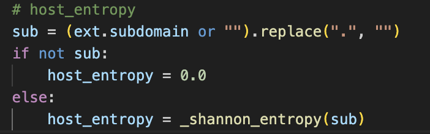
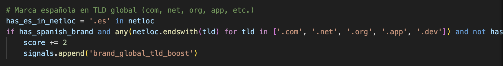
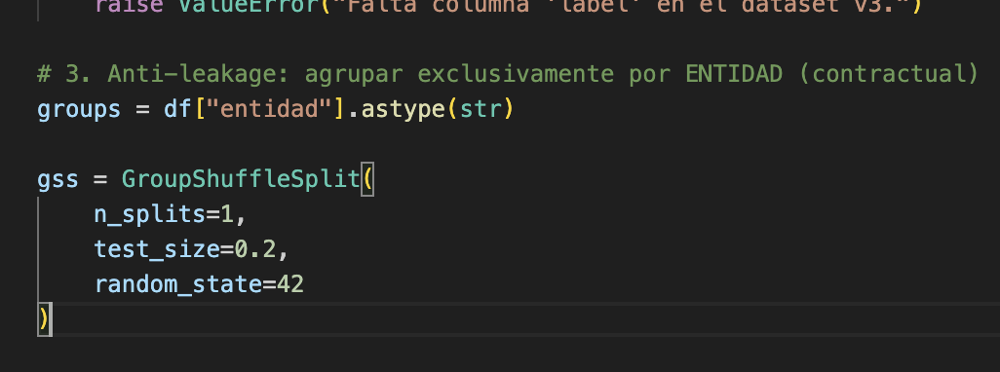

Propósito
Este directorio contiene fragmentos de código seleccionados y documentados que sirven como apoyo técnico al repositorio de presentación.
El objetivo no es mostrar una implementación completa, ni evaluar habilidades de programación, ni ofrecer un sistema ejecutable.
Su función es ilustrar decisiones técnicas concretas, criterios de diseño y prácticas aplicadas durante el desarrollo del sistema.
El foco está en el razonamiento, no en el volumen de código.

## Ejemplo: host_entropy
Fragmento del extractor de señales, orientado a capturar patrones de generación automática de subdominios, frecuentes en kits de phishing modernos.

**Intención**
Medir la aleatoriedad del subdominio como proxy de infraestructuras efímeras.
Detectar patrones estructurales sin depender de contenido ni marcas.

**Decisiones**
Se analiza exclusivamente el subdominio, no el dominio registrado.
Subdominio vacío → entropía 0.0 (caso explícito, sin ruido).
Señal continua y no decisoria, combinada por el modelo.

**Relación con el pipeline**
Aporta contexto estructural.
Independiente del scoring heurístico.
Complementa señales de infraestructura (infra_risk).

---

## Ejemplo: refuerzo por marca española en TLD global
Fragmento del sistema de scoring heurístico, utilizado para priorizar URLs potencialmente dirigidas a usuarios en España.

**Intención**
Detectar campañas que suplantan marcas españolas usando TLDs globales en lugar de .es.

**Decisiones**
Refuerzo moderado y no decisivo (+2), orientado a priorización.
Exclusión explícita de .es para evitar falsos positivos.
Señal interpretada siempre en combinación con otras evidencias.

**Alcance**
No clasifica URLs.
No sustituye al modelo.
Actúa únicamente como control previo de calidad y contexto.

---

## Ejemplo: validación anti-leakage por entidad
Fragmento del script de entrenamiento, diseñado para evitar leakage por campañas repetidas o marcas sobrerrepresentadas.

**Intención**
Garantizar que URLs de una misma entidad no aparezcan en train y test.
Evaluar generalización real, no memorización de campañas.

**Decisiones**
La entidad se define como unidad contractual de agrupación.
No se usa K-Fold clásico por alto riesgo de leakage en phishing.
Un único split prioriza estabilidad y trazabilidad, no tuning.

**Lectura**
Las métricas reflejan comportamiento estructural.
Refuerza el rol del modelo como combinador de señales, no detector end-to-end.

---

## Qué NO pretende mostrar este directorio
Este código no pretende:
- Ser una prueba de velocidad programando.
- Demostrar complejidad algorítmica.
- Sustituir la documentación del sistema.
- Representar un producto final.
Su función es apoyar el discurso técnico, no reemplazarlo.

## Relación con el resto del repositorio
Este directorio debe leerse junto con la documentación, no de forma aislada:
- Arquitectura → define dónde encaja el código.
- Scoring → explica por qué existe esta lógica.
- Features → delimita señales sin lógica de decisión.
- Modelo → muestra cómo se combinan las señales.
El código es una consecuencia del diseño, no su punto de partida.

## Estado
El sistema presentado es un prototipo técnico cerrado, diseñado como línea base estable y explicable.
Los fragmentos aquí mostrados reflejan decisiones tomadas en ese contexto y no se presentan como soluciones definitivas, sino como ejemplos razonados de diseño.