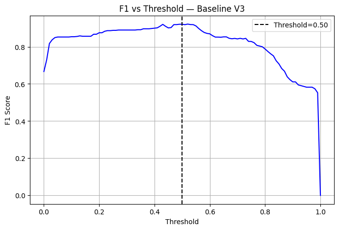
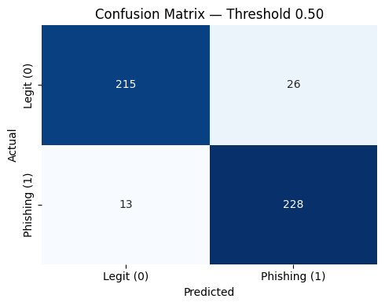
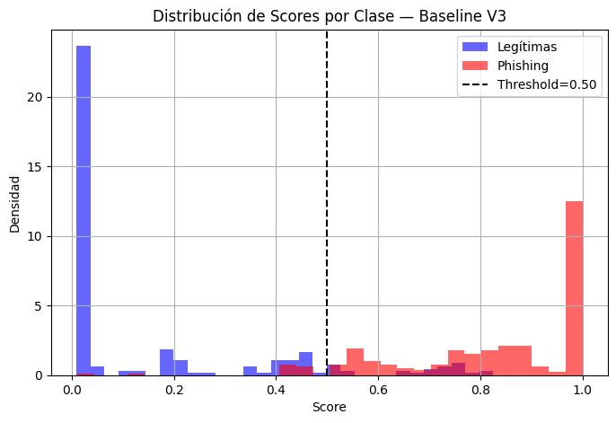
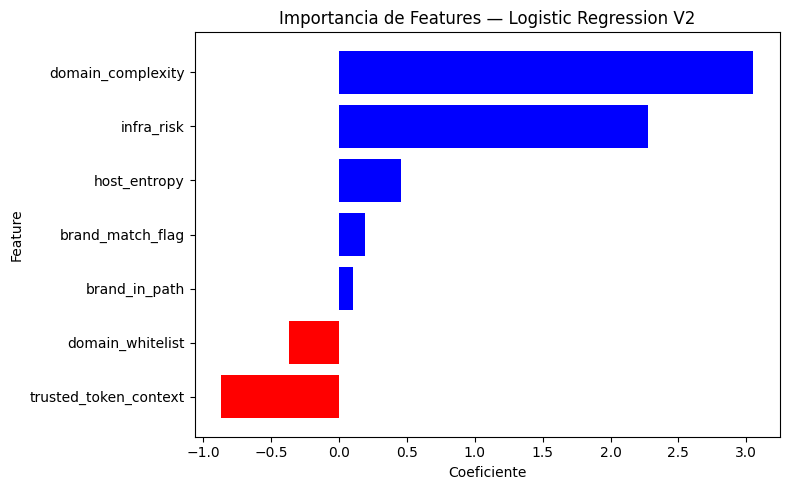

## 1. Objetivo de la evaluación

El objetivo de esta evaluación es validar el funcionamiento del pipeline de extremo a extremo y comprobar que el modelo baseline combina de forma consistente las señales definidas en el sistema.

Las métricas se presentan como evidencia de coherencia del diseño. El foco es asegurar estabilidad, explicabilidad y control del comportamiento bajo un dataset curado, manteniendo una referencia clara para futuras iteraciones.

## 2. Dataset de evaluación

La evaluación se realiza sobre un dataset curado manualmente a partir de feeds OSINT globales, diseñado para reflejar patrones reales de phishing dirigidos a usuarios en España.

El conjunto final está balanceado entre URLs legítimas y phishing y contiene información semántica mínima (URL, etiqueta, sector y entidad), permitiendo recalcular señales sin leakage y evaluar el comportamiento del modelo de forma controlada.

El proceso de construcción del dataset prioriza la calidad, la coherencia sectorial y la eliminación de ruido estructural, excluyendo explícitamente vectores de ataque que no pueden ser modelados de forma fiable con señales estructurales en esta versión del sistema (por ejemplo, acortadores de URLs o infraestructura comprometida).

## 3. Configuración del experimento

El experimento se plantea como una validación del pipeline completo, utilizando el modelo baseline definido en el sistema y el conjunto de señales estructurales y de contexto descritas previamente.

El entrenamiento y la evaluación se realizan sobre el dataset curado, manteniendo una separación clara entre datos de entrenamiento y validación. No se aplican técnicas de optimización agresiva ni búsqueda extensiva de hiperparámetros, con el objetivo de observar el comportamiento natural del modelo bajo un escenario controlado.

Esta configuración permite evaluar la coherencia entre las señales diseñadas, el modelo elegido y la interpretación de la salida, evitando introducir complejidad adicional que oculte problemas estructurales del sistema.

## 4. Métricas principales

El rendimiento del modelo se evalúa mediante métricas estándar de clasificación binaria, seleccionadas por su interpretabilidad y adecuación al problema. En concreto, se reportan **precision**, **recall**, **F1-score** y la **tasa de falsos positivos**, con el objetivo de analizar el equilibrio entre detección de phishing y control de ruido.

Las métricas principales se reportan utilizando un **umbral de decisión de 0.5**, seleccionado como punto de equilibrio entre sensibilidad y especificidad, coherente con el objetivo del sistema de priorizar la detección sin introducir un volumen excesivo de falsos positivos.

- **Precision:** 0.898  
- **Recall:** 0.946  
- **F1-score:** 0.921  
- **False Positive Rate:** 0.108  

Estos resultados muestran un comportamiento equilibrado del modelo, con una alta capacidad de detección de URLs de phishing y un control razonable de falsos positivos. 

## 5. Gráficas

A continuación se presentan las principales gráficas que ilustran el comportamiento del modelo y la validez del pipeline:

#### 5.1 Precision y recall vs umbral
Muestra el trade-off estabilidad/sensibilidad del score. El umbral 0.5 cae en una zona estable.

#### 5.2 F1 vs umbral
Valida que 0.5 está cerca del máximo y en región estable; no se usa para tuning agresivo.

#### 5.3 Matriz de confusión (umbral 0.5)
Confirma el equilibrio: alta detección con falsos positivos controlados.

#### 5.4 Distribución de scores
Se observa separación entre clases y una “zona gris” esperable. El score es interpretable como riesgo continuo.

#### 5.5 Importancia de señales
Las señales estructurales e infraestructura dominan; legitimidad actúa como corrección. Coherente con el diseño.

#### 5.6 Validación por entidad (GroupKFold)
La evaluación se realiza también con **GroupKFold por entidad**, asegurando que las URLs de una misma entidad no se reparten entre entrenamiento y test. Esto reduce el riesgo de leakage por campañas repetidas o patrones específicos de entidad y ofrece una estimación más realista de generalización.

## 6. Lectura de resultados

Los resultados confirman que el pipeline funciona de forma coherente de extremo a extremo y que el modelo baseline combina adecuadamente las señales diseñadas.

Las métricas y gráficas muestran un comportamiento estable del score, sin dependencia excesiva de un umbral concreto, y una separación razonable entre clases bajo un dataset curado. La validación por entidad refuerza que el modelo no memoriza campañas ni entidades concretas.

Estos resultados deben interpretarse como una validación del diseño y no como un rendimiento definitivo en producción. El sistema está pensado como una base sólida sobre la que iterar, ampliar cobertura sectorial e incorporar señales adicionales en futuras versiones.
